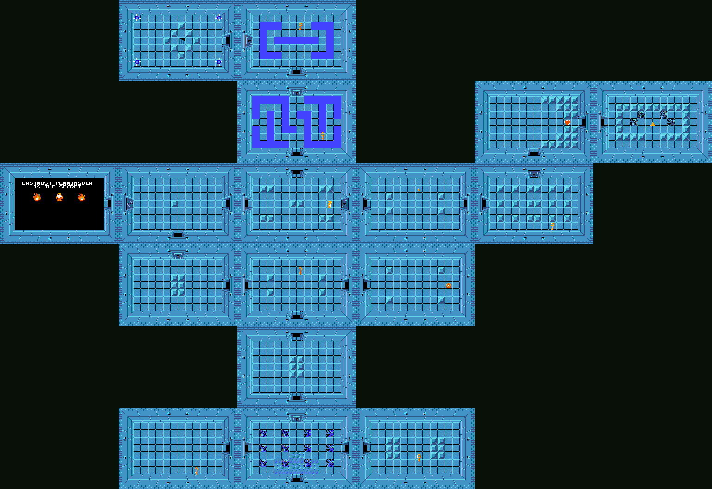

## video of Zelda 1 Level 1

[Youtube](https://www.youtube.com/watch?v=kmC4Juwl5a8)

## map of Zelda 1 Level 1

## Model 1: "key-lock graphs"

- define key-lock graph $LKG = \langle G,s,K,L\rangle$
- define walk
- define admissible
- define solvable and strongly solvable

## Tunnel graphs

- define tunnel graph with N locks
- define well-keyed as $\sum_{n=0}^{M} k(R_n) \geq {M + 1}$
  for all $M<N$.
- prove tunnel graph is well-keyed iff solvable iff strongly solvable

## Gluing graphs

- define gluing two key-lock graphs
- assert that gluing two (strongly) solvable graphs gives a (strongly)
  solvable graph
- prove that Z1L1 is strongly solvable without bomb doors, point out
  adding edges can hurt

## Connecting nearby vertices

- define nearby vertices
- assert that adding edges between nearby vertices in a (strongly)
  solvable graph results in a (strongly) solvable graph.
- prove that Z1L1 is strongly solvable.

## Problems

- Zelda 1 is more complicated: keys can be taken in and out of dungeons,
  there are other consumable/permanent items that must be considered
  (bow for Gohma/Ganon, raft for docks, ladder for moats)
- Walks are messy: a lot of different but equivalent ways to walk the
  graph the same way in terms of progression

## Model 2: "dungeon graphs"

- define dungeon graph $\langle G,s,I_e,I_p,T,B\rangle$
- define move as an edge $m=\{s,v\}$ satisfying
    - $B_{G/m}(e)=B_G(e), T_{G/m}(w)=T_G(w)$ for all $e\in E(G/m), w\in V(G/m)\setminus\{s_{G/m}\}$,
    - $T_{G/m}(s_{G/m})(i)=T_G(s_G)(i)+T_G(v)(i)$ for $i\in I_p$, and
    - $T_{G/m}(s_{G/m})(i)=T_G(s_G)(i)+T_G(v)(i)-B_G(e)(i)$ for $i\in I_e$.
- define dive as sequence of moves
- define solvable as there exists a complete dive using all edges
- define strongly solvable as every partial dive can be extended
- Conjecture: gluing two strongly solvable dungeon graphs results in a
  strongly solvable dungeon graph

## Application

- [Zelda randomizers!](https://www.youtube.com/watch?v=-nhQag-tSf0)
- Tech: [Luke's editor](https://stevenclontz.github.io/key-lock-graphs/map_editor/rooms.html)
