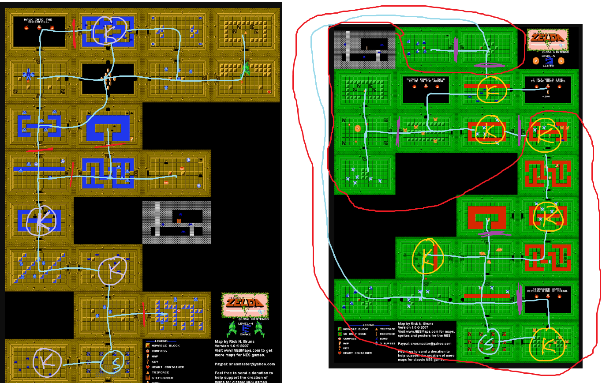

Level 4 is not $SK_2$: opening all doors without crossing the moat is a softlock.
(But there's an extra key in Level 3, not to mention shops that sell keys.)

Level 5 seems to be $SK_2$, but I don't think we have enough results to verify this.
Similar for Level 4 with the extra key from level 3...

